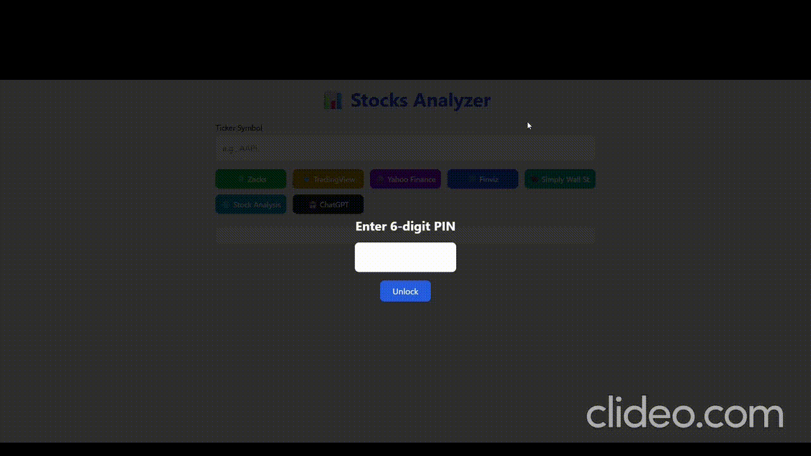

# 📊 Stock Analyzer

An interactive web-based stock analyzer app built with **FastAPI** and **vanilla JavaScript + Tailwind CSS**.

Query live data from **Zacks**, **TradingView**, **Yahoo Finance**, **Finviz**, **Simply Wall Street** and **Stock Analysis** — all through a sleek frontend and Python-powered backend.<br/>
The **ChatGPT** option performs query on all of the above sources and gives a general overview of the stock according to the collected data from those sources using on-premise ChatGPT LLM.



---

## ⚠️ Disclaimer

This application is **not intended to provide financial advice**.

This application was tested **only** on a UNIX OS env. Any Windows or macOS usage is strictly under the user's self discretion.

This application is not garanteed to work 100% of the times. It is meant for personal use.

It is strictly for **educational and non-commercial use only**.

All data is sourced from third-party services:

- [Zacks](https://www.zacks.com/)
- [TradingView](https://www.tradingview.com/)
- [Yahoo Finance](https://finance.yahoo.com/)
- [Finviz](https://finviz.com/)
- [Simply Wall Street](https://simplywall.st/?view/)
- [Stock Analysis](https://stockanalysis.com/)
- [ChatGPT](https://openai.com/)

Use of this application is **subject to the terms of use of each of the above services**.  
Always conduct your own research and consult a licensed financial advisor before making investment decisions.


## 🚀 Features

- 🔍 Lookup a stock ticker across:
  - Zacks
  - TradingView
  - Yahoo Finance
  - Finviz
  - Simply Wall Street
  - Stock Analysis
- 🧠 Generate stock-specific insights from the above sources using a fixed ChatGPT prompt
- 🌐 Clean and responsive UI with Tailwind CSS
- 📈 Automatically renders JSON responses into human-readable HTML
- 🔗 Hyperlink and Markdown support for rich text formatting
- 🛡️ PIN code when running the app for security

---

## 🧩 Tech Stack

### 🔙 Backend

- **FastAPI** – High-performance async web framework for API development
- **pandas** – Data cleaning, manipulation, and structured tabular responses
- **requests** – For making HTTP requests to external sources
- **imgkit** – Convert HTML to PNG (used for Zacks visual charts and for TradingView)
- **Pillow (PIL)** – Image loading and processing
- **pytesseract** – OCR (optical character recognition) for reading text from images (specifically for TradingView)
- **yfinance** – Pulls financial market data from Yahoo Finance
- **tradingview_ta** – Fetches data analysis from TradingView
- **finvizfinance** – Scrapes Finviz data
- **g4f** – Free ChatGPT wrapper client for prompt-based AI responses
- **CORS Middleware** – FastAPI middelware for frontend-backend communication
- **bcrypt** – Hashing of PIN code for app security

### 🌐 Frontend

- **HTML + JavaScript (Vanilla)**
- **Tailwind CSS** – Utility-first CSS framework for responsive styling
- **Dynamic rendering** – Converts JSON/text into structured HTML cards
- **Tailwind Typography plugin** – For improved markdown and readability

---

## 🖼️ UI Preview

> Enter a ticker symbol (notice that actual company name will not work), click a data source, and get back structured financial data.

---

## 📁 Project Structure

├── **app.py** # FastAPI backend </br>
├── **ticker constants.py** # Holding constants for backend usage </br>
├── **run_web.sh** # Run the web app </br>
├── **create_pswd.sh** # PIN code creation for app security </br>
├── **requirements.txt** # Prerequisites for pip install </br>
├── **static**/</br>
│ ├── **index.html** # Main frontend page </br>
└── **stock_scrapper.py** # Backend logic </br>

## 🛠️ Setup Instructions

### 0. Install prequisities (for Linux):
```bash
sudo apt-get install python3-tk python3-dev
# if you are running through WSL:
export DISPLAY=:0
```

### 1. Clone the repository
```bash
git clone https://github.com/omerwer/Personal-projects.git
cd python/stocks-analysis/
```

### 2. Create a virtual environment
```bash
python3 -m venv stocks_analysis_env
source stocks_analysis_env/bin/activate
```

### 3. Install `wkhtmltoimage` (required for imgkit)
* #### Ubuntu/Debian:
```bash
sudo apt-get install wkhtmltopdf
```
* #### macOS (with Homebrew):
```bash
brew install Caskroom/cask/wkhtmltopdf
```
* #### Windows:
Download from [wkhtmltopdf.org](https://wkhtmltopdf.org/downloads.html)
⚠️ Make sure wkhtmltoimage is available in your system's PATH (hardcoded to default `/usr/bin/wkhtmltoimage`).


### 4. Install dependencies
```bash
pip install -r requirements.txt
```

### 5. Create PIN code for app security
```bash
./create_pswd.sh
```

### 6. Run the app
```bash
./run_web.sh
```

Server will run at: http://127.0.0.1:3000

